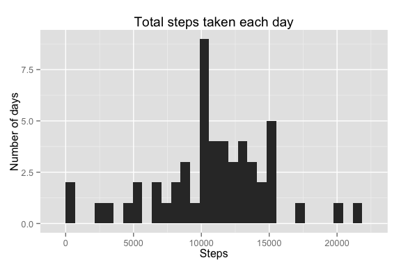
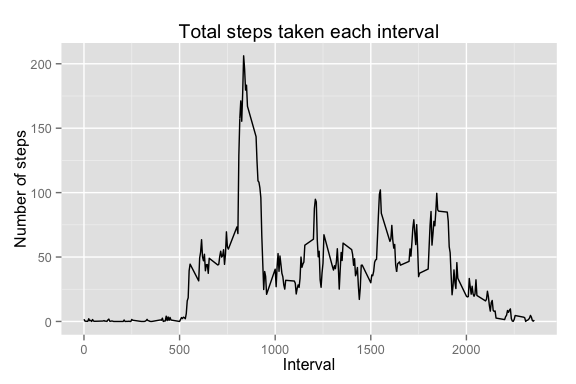
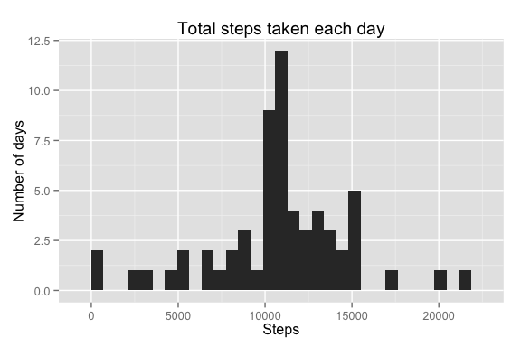
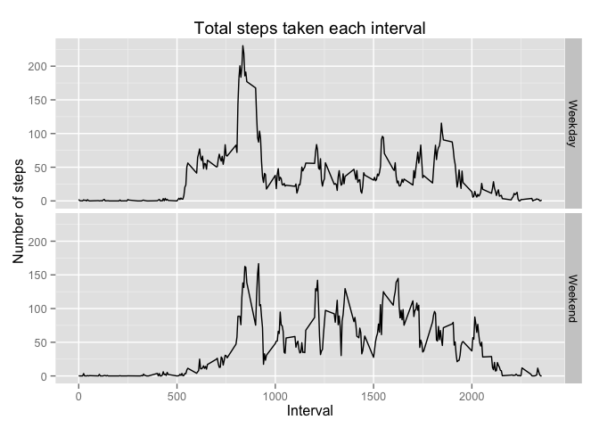

# Reproducible Research: Peer Assessment 1


```r
library(knitr)
opts_chunk$set(echo = TRUE)
options(scipen = 999)
library(ggplot2)
```

## Loading and preprocessing the data


```r
activity <- read.csv("activity.csv")
```

## What is mean total number of steps taken per day?

Create a histogram of the total number of steps taken each day. 


```r
perDay <- aggregate(steps ~ date, data = activity, FUN = "sum")
qplot(steps, data = perDay, geom = "bar", main = "Total steps taken each day", xlab = "Steps", ylab = "Number of days")
```

```
## stat_bin: binwidth defaulted to range/30. Use 'binwidth = x' to adjust this.
```

 

```r
mean = mean(perDay$steps)
median = median(perDay$steps)
```

The mean number of steps per day is 10766.1886792, and the median is 10765. 

## What is the average daily activity pattern?


```r
perInterval <- aggregate(steps ~ interval, data = activity, FUN = "mean")
qplot(interval, steps, data = perInterval, geom = "line", main = "Total steps taken each interval", xlab = "Interval", ylab = "Number of steps")
```

 

```r
maxInterval = perInterval[perInterval$steps == max(perInterval$steps), "interval"]
```

The interval with the maximum number of steps is 835. 

## Imputing missing values


```r
numberOfNA <- sum(is.na(activity$steps))
```
There are 2304 missing values in the data set. 

Fill in missing values in a copy of the dataset by using mean number of steps for that 5-minute interval. 

```r
activity2 <- activity
for (i in perInterval$interval){
    activity2[is.na(activity2$steps) & activity2$interval == i,"steps"] <- perInterval[perInterval$interval == i,"steps"] 
}
```
Create a histogram of the total number of steps taken each day (without missing values). 


```r
perDay2 <- aggregate(steps ~ date, data = activity2, FUN = "sum")
qplot(steps, data = perDay2, geom = "bar", main = "Total steps taken each day", xlab = "Steps", ylab = "Number of days")
```

```
## stat_bin: binwidth defaulted to range/30. Use 'binwidth = x' to adjust this.
```

 

```r
mean2 = mean(perDay2$steps)
median2 = median(perDay2$steps)
```

The mean number of steps per day is 10766.1886792, and the median is 10766.1886792. 

The mean and median are roughly the same as from the first part. The impact of inputing missing data is that days which had no data now have around the mean/median number of steps after being filled in. 

## Are there differences in activity patterns between weekdays and weekends?


```r
activity2$date <- as.Date(activity2$date, "%Y-%m-%d")
activity2$weekday <- "Weekday"
activity2[weekdays(activity2$date) %in% c("Saturday", "Sunday"), "weekday"] <- "Weekend"
activity2$weekday <- factor(activity2$weekday)
perInterval2 <- aggregate(steps ~ interval + weekday, data = activity2, FUN = "mean")
qplot(interval, steps, data = perInterval2, facets = weekday~., geom = "line", main = "Total steps taken each interval", xlab = "Interval", ylab = "Number of steps")
```

 
